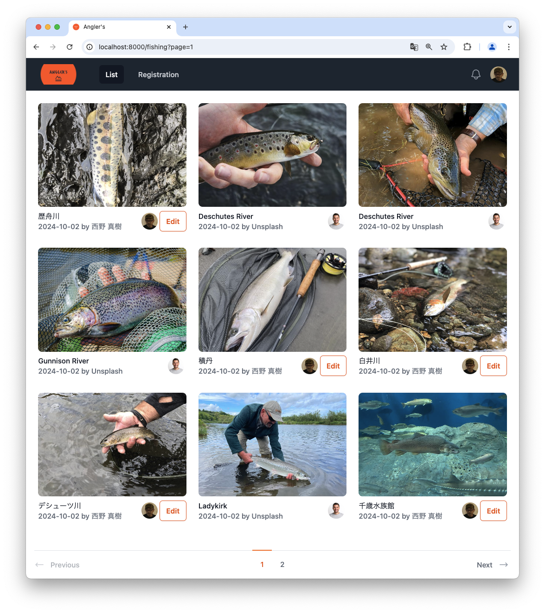

## About Angler's

### Claris Conference 2024

#### T-28 Introduction to Integrating Popular Framework Laravel with Claris FileMaker (Compatible with Laravel 11)

Sample Application


## Execution Environment

- Docker Desktop
- PHP 8.3
- Composer
- Node.js and npm
- FileMaker Server 21.0.2.202

## Startup Instructions

1. Duplicate `.env.example` and rename it to `.env`
2. Set the DB_HOST configuration value to the IP address of the FileMaker Server (fms)
3. Install PHP packages with `composer install`
4. Install Node.js packages with `npm install`
5. Generate the APP_KEY using `php artisan key:generate`
6. Start Laravel Sail with `./vendor/bin/sail up -d`
7. Enter the Laravel container with `docker exec -it laravel.test-1 /bin/bash`
8. Create a link to the storage directory in public with `php artisan storage:link`
9. Exit the container with `exit`
10. User registration is not implemented, so manually create a sample user in the members (users) table with `php artisan tinker` in interactive mode: `\App\Models\User::create(['name' => 'test_user', 'email' => 'test_user@hoge.com', 'password' => \Hash::make('12345678')]);`
11. Run the app in development mode with `npm run dev`
12. Access the application at `localhost:8000`

> [!NOTE]
> In the `.env` file, the SSL verification setting is `MY_VERIFY_SSL=false`, but this is only for the development environment. It should be set to true in production.

### anglers.fmp12

```
admin:1234
```
